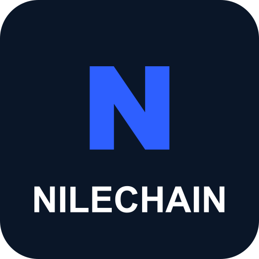

<p align="center">
  <a href="https://github.com/Leonorm56/NileChain" target="_blank">
    
  </a>
</p>

<h1 align="center">NileCloud</h1>

<p align="center">
  <strong>Cloud-Based Farming Platform for NileChain</strong>
</p>

<p align="center">
  Run all NileChain farmers autonomously on your server, 24/7
</p>

---

## Overview

**NileCloud** is a cloud-based farming platform that runs NileChain farmers directly on your server. Unlike the browser extension which runs locally, NileCloud operates autonomously in the cloud, managing multiple Telegram accounts, executing farming tasks 24/7, and providing centralized control through the Cloud Manager tool in NileChain.

### Key Features

- **Cloud-Based Farming** - Runs all farmers directly on your server, no browser needed
- **Autonomous Operation** - 24/7 automated farming without manual intervention
- **Cloud Manager Integration** - Control everything through NileChain's Cloud Manager
- **Multi-Account Management** - Handle unlimited Telegram accounts
- **Real-Time Monitoring** - Live updates and notifications via Telegram topics
- **Database Backend** - Persistent storage for accounts, proxies, and sessions
- **Secure API** - JWT-based authentication for Cloud Manager
- **Scheduled Tasks** - Automated farming cycles and maintenance
- **Proxy Support** - Built-in proxy rotation and management

---

## Quick Installation

### Prerequisites

- **OS:** Ubuntu 20.04+ / Debian 11+
- **RAM:** Minimum 1GB (2GB+ recommended)
- **Node.js** v18+ with pnpm

### One-Line Install

```bash
bash <(curl -s https://raw.githubusercontent.com/Leonorm56/nilecloud/main/install.sh)
```

### Manual Install

```bash
git clone https://github.com/Leonorm56/nilecloud.git
cd nilecloud
pnpm install
cp .env.example .env
nano .env   # Edit with your config
pnpm db:migrate && pnpm db:seed
pnpm start
```

> **Note:** After installing, set the server IP as your **Cloud Server URL** in NileChain extension settings → Cloud Manager.

---

## Environment Variables

| Variable | Description |
|---|---|
| `PORT` | Server port (default: 3000) |
| `JWT_SECRET_KEY` | Secret for JWT tokens |
| `TELEGRAM_BOT_TOKEN` | Bot token for notifications |
| `TELEGRAM_GROUP_ID` | Telegram group for logs |
| `CAPTCHA_PROVIDER` | Captcha provider (2captcha, etc.) |
| `CAPTCHA_API_KEY` | Captcha API key |
| `NODE_ENV` | `production` or `development` |

---

## Architecture

```
┌─────────────────────┐
│  NileChain          │
│  Cloud Manager      │◄────── Manage accounts, farmers
│  (Extension/PWA)    │
└──────────┬──────────┘
           │ HTTPS/REST API (JWT Auth)
┌──────────▼──────────┐
│  NileCloud          │
│  Node.js Server     │◄────── Runs all farmers in cloud
│  (PM2)              │
└──────────┬──────────┘
           │
      ┌────┴─────┬──────────────┐
      │          │              │
┌─────▼────┐ ┌──▼────────┐ ┌──▼──────────┐
│ SQLite   │ │ Telegram  │ │ Telegram    │
│ Database │ │ Accounts  │ │ Bot (Logs)  │
│          │ │ (Sessions)│ │             │
└──────────┘ └───────────┘ └─────────────┘
```

---

## Adding Custom Farmers

Place your farmer classes in the `farmers/` directory. Each farmer must:

1. Extend `BaseFarmer` from `vendor/shared/lib/BaseFarmer.js`
2. Have a unique `static id`
3. Implement `process()`, `fetchAuth()`, `getAuthHeaders()`, `getReferralLink()`
4. Set `static published = true`

Farmers are auto-discovered on server start.

---

## License

MIT

---

<p align="center">Built for <a target="_blank" href="https://github.com/Leonorm56/NileChain">NileChain</a></p>
